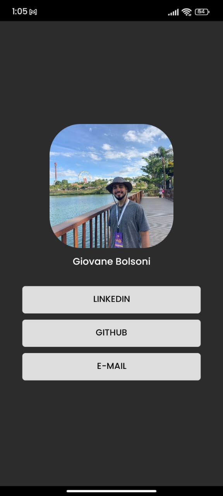

# Portfolio

This project was developed with the aim of creating a mobile application that allows users to access and view my portfolio in a practical and intuitive way. The app offers a user-friendly interface so that users can learn more about my work, visualize my experiences and projects, and access my professional social networks.

## Installation

- Clone the project

```bash
 git clone https://github.com/g-bolsoni/native-portfolio.git
```
- Open your terminal and run this command
```bash
npm run start
```

## App
The image bellow is the app runnig.



## Contributing

Pull requests are welcome. For major changes, please open an issue first
to discuss what you would like to change.

Please make sure to update tests as appropriate.